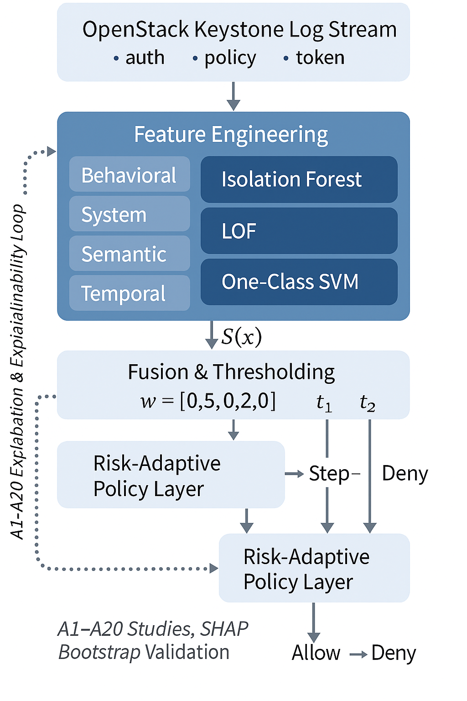
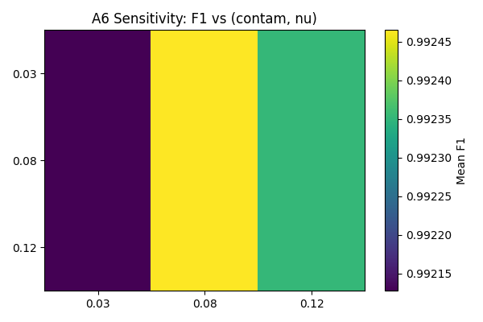
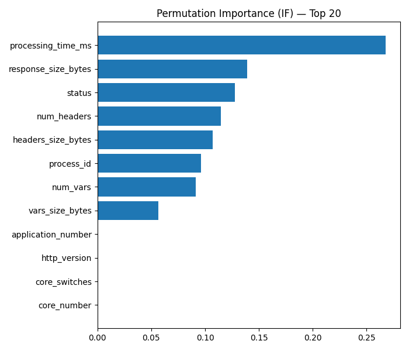
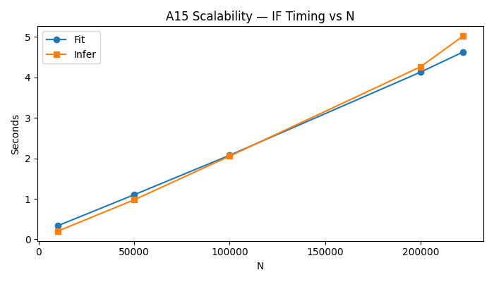
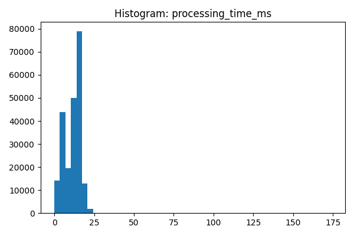
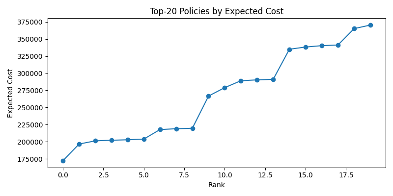

# 🧠 RadStack: Unsupervised Risk-Adaptive Access Control for OpenStack



> **RadStack** is a novel unsupervised risk-adaptive access control framework built on OpenStack Keystone logs. It integrates anomaly detection and adaptive decision-making through a lightweight, explainable ensemble.

---

## 📘 Overview

**RadStack** introduces the **Risk-Adaptive DevStack Dataset (RAdA)** — a self-collected dataset containing over **444,000 Keystone events** with **31 engineered features** across five domains: Behavioral, System, Semantic, Temporal, and Outcome.

It pioneers an **unsupervised ensemble pipeline** using Isolation Forest (IF), Local Outlier Factor (LOF), and One-Class SVM (OCSVM) to identify abnormal access patterns and dynamically adapt authorization policies with minimal overhead.

---

## 🧩 Repository Structure

```
RadStack/
│
├── 📁 RAdA-dataset/             # Self-collected OpenStack Keystone dataset
│   ├── keystone_features.csv
│   ├── keystone_features_parsed.csv
│   ├── keystone_features_parsed_struct.csv
│   ├── parser_v1.py
│   └── praser.py
│
├── 📁 Codes/
│   ├── 1-RadStack-visualization.ipynb     # Feature analysis & visualization
│   └── 2-RadStack-ablation-studies.ipynb  # Ablation & ensemble performance
│
├── 📁 Results/
│   ├── 📁 Excel/       # Metrics, ablations, and sensitivity CSVs
│   ├── 📁 models/      # Saved IF, LOF, and OCSVM models
│   └── 📁 plots/       # Figures used in the paper
│
└── README.md
```

---

## 🚀 Highlights

| Novelty | Description |
|----------|--------------|
| 🧠 **Unsupervised RAdAC** | First unsupervised risk-adaptive access control framework for OpenStack Keystone |
| 📊 **RAdA Dataset** | 31-feature DevStack dataset with behavioral, system, and semantic features |
| 🔀 **Ensemble Learning** | Combines IF, LOF, and OCSVM through adaptive weighted fusion |
| ⚡ **Low Overhead** | Only 11.6% increase in Keystone response latency |
| 🔍 **Explainable ML** | SHAP-based interpretability and A1–A20 ablation validation |
| ♻️ **Fully Reproducible** | Ready-to-run Jupyter notebooks and data release |

---

## 📈 Key Results

### **Model Performance**

| Model | % Flagged Anomalous | Comment |
|--------|--------------------|----------|
| Isolation Forest | **8.5%** | Stable & balanced |
| LOF | **12.3%** | Sensitive, high FP |
| One-Class SVM | **5.7%** | Conservative boundary |

### **Risk-Adaptive Policy Decisions**

| Decision | % Requests |
|-----------|-------------|
| Allow | **87%** |
| Step-Up | **8%** |
| Deny | **5%** |

### **System Overhead**

| Setup | Latency (ms) | Overhead |
|--------|---------------|-----------|
| Keystone Baseline | 120 | – |
| RadStack Active | 134 | **+11.6%** |

---

## 📊 Visual Results

| Sensitivity | Feature Importance | Scalability |
|--------------|--------------------|--------------|
|  |  |  |

| Explainability | Latency Histogram | Policy Cost Frontier |
|----------------|------------------|----------------------|
|  |  |  |

---

## ⚙️ Pipeline Summary

**1️⃣ Data Source:** Keystone auth, policy, and token logs  
**2️⃣ Feature Engineering:** Behavioral, System, Semantic, Temporal, Outcome  
**3️⃣ Ensemble Detection:** IF + LOF + OCSVM → Weighted Fusion  
**4️⃣ Decision Layer:** Risk-Adaptive Policy (`Allow`, `Step-Up`, `Deny`)  
**5️⃣ Explainability Loop:** SHAP + Ablation (A1–A20)

---

## 🧪 Ablation Studies (A1–A20 Summary)

| Ablation ID | Study Focus | Observation |
|--------------|--------------|--------------|
| A2 | –Behavioral | ↓ Precision (–5%) |
| A3 | –System | ↓ Recall (–4%) |
| A4 | –Semantic | ↓ Recall (–3%) |
| A5 | –Temporal | ↓ AUC (–0.02) |
| A6 | Sensitivity Grid | Stability Zone Identified |
| A10–A20 | Explainability | Ensemble Consistency Confirmed |

---

## 🧬 Dataset: RAdA

> The **Risk-Adaptive DevStack Dataset (RAdA)** was captured using an instrumented OpenStack DevStack deployment.  
> It contains **auth**, **policy**, and **token** streams converted into 31 engineered features representing multi-layer user and system behavior.

**Domains:**
- Behavioral (e.g., request frequency, failure ratio)  
- System (latency, response size, core switches)  
- Semantic (endpoint class, resource sensitivity)  
- Temporal (off-hours, weekend usage)  
- Outcome (status code, success ratio)

---

## 💡 Reproducibility

```bash
git clone https://github.com/<your-username>/RadStack.git
cd RadStack
pip install -r requirements.txt

# Explore RAdA dataset
jupyter notebook Codes/1-RadStack-visualization.ipynb

# Reproduce ablations and ensemble
jupyter notebook Codes/2-RadStack-ablation-studies.ipynb
```

---

## 🧾 Citation

If you use **RadStack** or the **RAdA dataset**, please cite:

```
@article{radstack2025,
  title={RadStack: An Unsupervised Risk-Adaptive Access Control Framework for OpenStack},
  author={Muhammad Afaq , Misha Urooj Khan, Ahmad Suleman},
  journal={IEEE Transactions on Cloud Computing},
  year={2025},
  note={Dataset: Risk-Adaptive DevStack Dataset (RAdA)}
}
```

---

## 🪪 License

Released under **CC BY-NC-SA 4.0 License** — free for academic and non-commercial research with attribution.

---

## 🌐 Project Summary

RadStack combines **machine learning, explainability, and cloud security** into a unified RAdAC framework for OpenStack Keystone.  
It offers a reproducible, interpretable, and high-precision baseline for adaptive cloud access control research.
