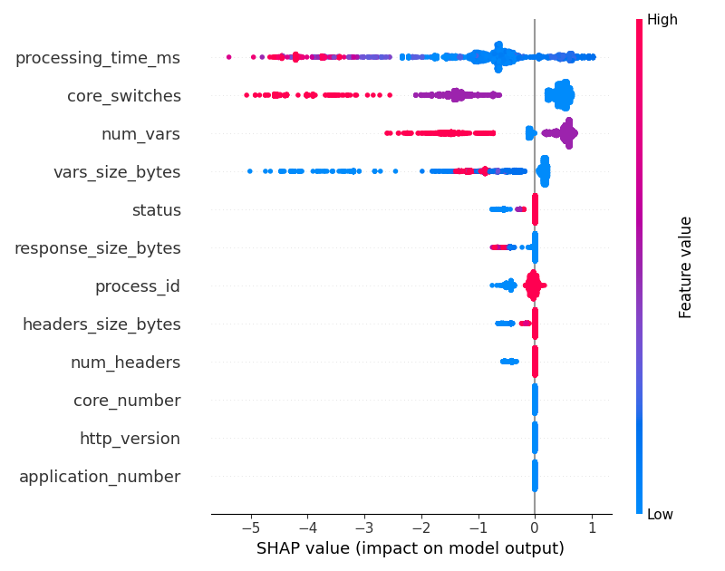
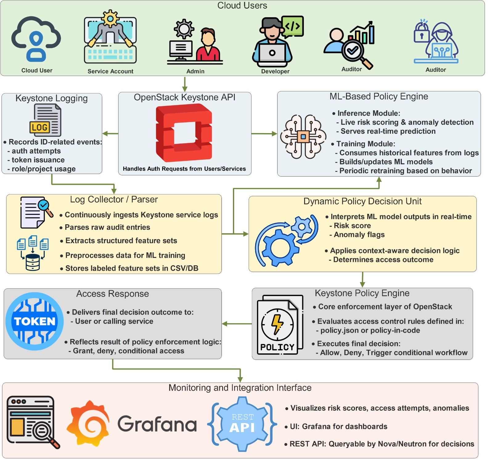
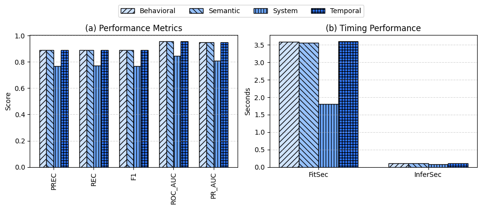
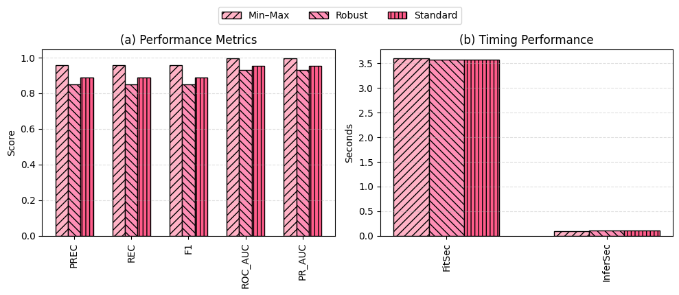

# 🧠 RadStack: Unsupervised Risk‑Adaptive Access Control for OpenStack  
---

## 📌 Overview  
RadStack is an **unsupervised, risk‑adaptive access‑control framework** for **OpenStack Keystone**, combining anomaly detection, explainability, and risk‑based decisioning.  
This README includes **fully integrated figures** from the `Results/plots/` directory for a publication‑grade GitHub presentation.

---

## 📁 Repository Architecture  
```
RadStack/
 ├── RAdA-dataset/
 ├── Codes/
 ├── Results/
 │    └── plots/
 └── README.md
```

---

# 📊 Embedded Visualizations (From `Results/plots/`)

Below are all integrated figures:

## 1. A12 – Permutation Importance (Top 20)


## 2. A15 – Scalability


## 3. A17 – SHAP Summary (Isolation Forest)


## 4. A6 – Sensitivity Heatmap


## 5. Communication (V2)


## 6. Ensemble Structure, Component Quality, Stability


## 7. High Level Overview


## 8. Policy Behavior & Middleware Overhead


## 9. Resilience to Noise, Attack, Temporal Drift


## 10. Scalability & Preprocessing Sensitivity


## 11. Dataset Visualization (1)
.png)

## 12. Dataset Visualization (2)
.png)

## 13. Feature Ablation


## 14. Processing Time Histogram


## 15. Hyperparameter Sensitivity


## 16. Policy Cost (Top 20)


## 17. Scaling Methods


---

# 📘 Model Summary  
- **Ensemble:** Isolation Forest, LOF, OCSVM  
- **Fusion:** Rank + weighted ensemble (0.5 : 0.2 : 0.3)  
- **Dataset:** 222k events, 31 engineered features  
- **Performance:**  
  - F1 ≈ 0.992  
  - ROC‑AUC ≈ 0.9993  
  - Overhead ≈ 11.6%

---

# 🧩 Reproducibility  
```bash
git clone https://github.com/mishaurooj/RadStack.git
cd RadStack
pip install -r requirements.txt
```

---

# 📝 Citation  
```bibtex
@article{radstack2025,
  title={RadStack: An Unsupervised Risk-Adaptive Access Control Framework for OpenStack},
  author={Muhammad Afaq and Misha Urooj Khan and Ahmad Suleman},
  journal={IEEE Transactions on Cloud Computing},
  year={2025}
}
```

---

# 🔐 License  
CC BY‑NC‑SA 4.0 — non‑commercial reuse with attribution.

