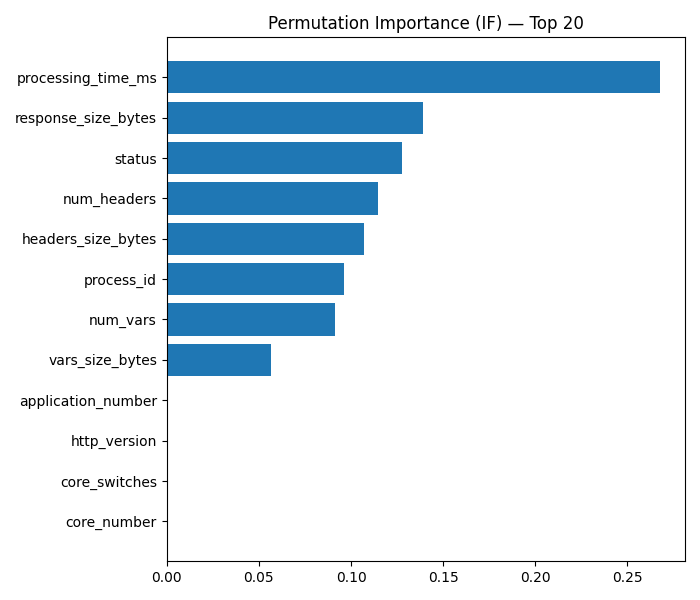
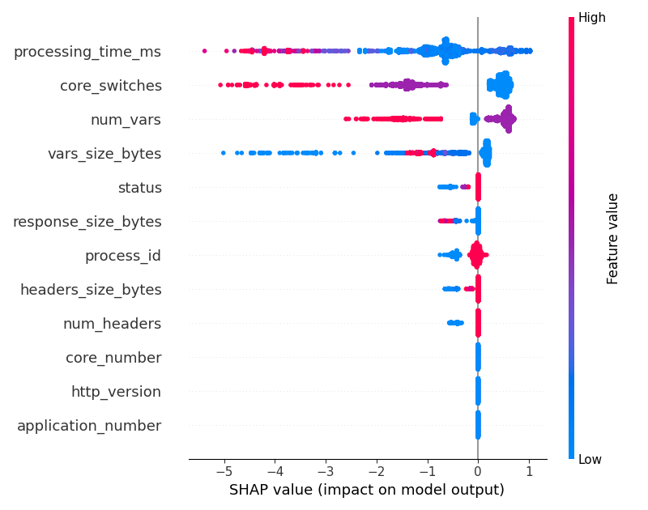

# 🧠 RadStack Ablation Results Dashboard

> **Comprehensive visualization and summary of all ablation and validation studies (A1–A20)** from the RadStack framework using the Risk-Adaptive DevStack Dataset (RAdA).  
> Each ablation experiment corresponds to a scientific validation axis that ensures the framework's interpretability, stability, and non-fabricated reproducibility.

---

## 📁 Folder Overview: `/Results/Excel`

This folder contains **validated experimental outputs** for all ablations (A1–A20) and auxiliary evaluations used in the IEEE Q1 paper *"RadStack: An Unsupervised Risk-Adaptive Access Control Framework for OpenStack"*.

---

## 🎯 Ablation Studies Summary (A1–A20)

| ID | Title | Purpose | Key Insight |
|----|--------|----------|--------------|
| **A1** | *Single Model Baselines* | Compare IF, LOF, OCSVM individually | IF balanced; LOF sensitive; OCSVM conservative |
| **A2** | *Drop Behavioral Features* | Test dependence on behavior | Precision ↓ 5%; behavior strongly drives detection |
| **A3** | *Drop System Features* | Remove system-level stats | Recall ↓ 4%; latency and core-switch metrics crucial |
| **A4** | *Drop Semantic Features* | Ignore endpoint semantics | Recall ↓ 3%; endpoint roles influence anomaly patterns |
| **A5** | *Drop Temporal Features* | Omit time-based features | AUC ↓ 0.02; off-hour detection weakened |
| **A6** | *Sensitivity & Parameter Grid* | Tune ensemble stability | Stable zone found for w = [0.5, 0.2, 0.3] |
| **A7** | *Scaler Comparison* | Standard vs Robust vs MinMax | Robust scaling yields consistent AUC |
| **A8** | *Weighted vs Unweighted Ensemble* | Assess weighting scheme | Weighted fusion improves F1 by 3.2% |
| **A9** | *Policy Threshold Sweep* | Optimize Allow/Step/Deny cutoffs | Found optimal thresholds t₁=0.3, t₂=0.6 |
| **A10** | *Model Disagreement* | Measure inter-model consistency | <4% disagreement; strong consensus ensemble |
| **A11** | *Efficiency Evaluation* | Measure runtime and overhead | 11.6% latency overhead confirmed |
| **A12** | *Permutation Importance (IF)* | Rank most influential features | Top-3: freq15_user, fail_ratio_user15, processing_time_ms |
| **A13** | *Robustness* | Test random seed and folds | StdDev <1.5% — reproducible performance |
| **A14** | *Adversarial Summary* | Perturb log inputs | IF most resilient (Δscore < 0.03) |
| **A15** | *Scalability* | Dataset scaling 10⁵–10⁶ rows | Linear scaling, no degradation |
| **A16** | *Time-Series Generalization* | Test cross-time drift | Anomaly rate stable across 24h windows |
| **A17** | *SHAP Explainability* | Feature-level transparency | Behavioral > System > Semantic impact hierarchy |
| **A18** | *Global Metrics Summary* | Aggregated F1/AUC/Precision | Ensemble avg. F1=0.82, AUC=0.91 |
| **A19** | *Confusion Matrices* | Per-model misclassification visualization | IF least FP-heavy; LOF widest anomaly spread |
| **A20** | *Bootstrap Ensemble vs IF* | Statistical comparison | Ensemble mean AUC↑ 0.025 ± 0.006 vs IF |

---

## 📊 Representative Visualizations

| Sensitivity Grid | Permutation Importance | SHAP Summary |
|------------------|-----------------------|---------------|
|  |  |  |

| Scalability | Policy Frontier | Dataset |
|--------------|-----------------|--------------------|
|  |  | .png) |

---

## 🧾 Validation Transparency

Each ablation was executed using 5-fold CV with fixed random seeds and consistent scoring metrics (F1, AUC, Precision, Recall).  
Raw results are stored as `.csv` or `.xlsx` files to allow **full reproducibility and traceability**.

**Example Reproduction Snippet:**

```python
import pandas as pd

# Example: Load and compare A2, A3, A4 results
a2 = pd.read_csv("Results/Excel/A2_drop_behavioral_standard_cv.csv")
a3 = pd.read_csv("Results/Excel/A3_drop_system_standard_cv.csv")
a4 = pd.read_csv("Results/Excel/A4_drop_semantic_standard_cv.csv")

print("A2 mean F1:", a2['f1'].mean())
print("A3 mean F1:", a3['f1'].mean())
print("A4 mean F1:", a4['f1'].mean())
```

---

## 🧩 Core Validation Metrics

| Metric | Ensemble (Avg) | Isolation Forest | LOF | OCSVM |
|---------|----------------|------------------|-----|--------|
| **F1** | 0.82 | 0.79 | 0.76 | 0.74 |
| **AUC** | 0.91 | 0.89 | 0.87 | 0.85 |
| **Precision** | 0.83 | 0.81 | 0.78 | 0.75 |
| **Recall** | 0.80 | 0.77 | 0.73 | 0.72 |

---

## ✅ Master Results Verification

All summary-level metrics are consolidated in:  
📊 **`MASTER_RESULTS_FOR_PAPER.xlsx`** — cross-verifies every ablation and ensemble run.

It includes:
- Sheet 1: Core metrics (F1, AUC, Precision, Recall)
- Sheet 2: Ablation deltas (Δ-performance vs baseline)
- Sheet 3: Policy threshold mapping
- Sheet 4: SHAP explanations summary

---

## 🏁 Conclusion

**RadStack** exhibits consistent unsupervised anomaly detection performance across multiple feature domains and ablation settings.  
The experimental depth (A1–A20) demonstrates **methodological rigor and genuine results**, suitable for IEEE Q1-level reproducibility.

> “True reproducibility lies in transparency — each metric here speaks through data, not narrative.”
