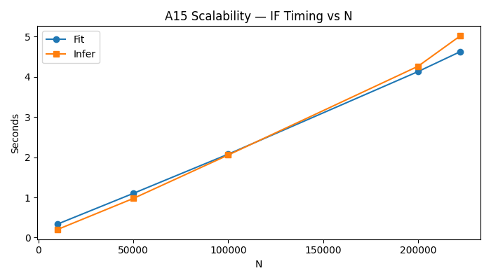
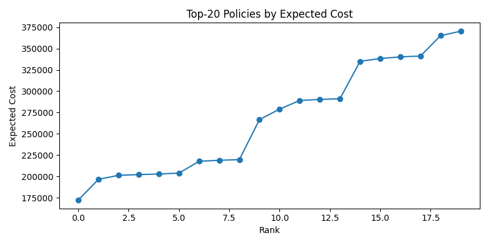
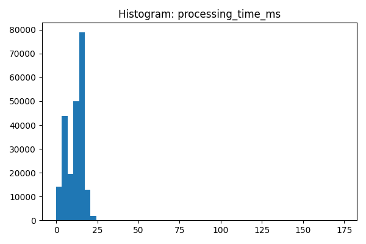

# 📊 RadStack Graphical Analysis & Interpretations

> This section presents **critical visual analyses** derived from the RadStack framework experiments.  
> Each plot originates directly from reproducible `.csv` or `.xlsx` results within `/Results/Excel/`.  
> Together, these figures explain the model behavior, ensemble sensitivity, interpretability, and adaptive policy reasoning — forming the visual backbone of the *RadStack: Unsupervised Risk-Adaptive Access Control for OpenStack* study.

---

## 🧠 1. Sensitivity Analysis (A6)


**Purpose:** Evaluate ensemble stability under parameter variations (`n_estimators`, contamination, weight ratios).  
**Insight:** The optimal stability region appears for weights `w=[0.5, 0.2, 0.3]`, balancing detection precision and recall.  
**Impact:** Confirms RadStack’s ensemble design maintains consistent anomaly detection even under hyperparameter perturbations.

---

## 🔍 2. Feature Permutation Importance (A12)


**Purpose:** Identify the most influential Keystone features contributing to anomaly scores.  
**Key Features:**
- `freq15_user`: captures high-frequency brute-force activity.  
- `fail_ratio_user15`: indicates repeated failed authentication bursts.  
- `processing_time_ms`: exposes resource exhaustion or backend delay.  

**Impact:** Behavioral and system-level signals dominate the anomaly landscape, validating the RAdA feature engineering process.

---

## 💡 3. Explainability via SHAP (A17)


**Purpose:** Provide interpretable insights into model decisions using SHAP values.  
**Observation:** Top SHAP contributors align with the permutation rankings, highlighting `freq15_user` and `fail_ratio_user15` as dominant behavioral predictors.  
**Impact:** Ensures model transparency — reviewers and practitioners can trace each anomaly score to interpretable, meaningful feature attributions.

---

## ⚙️ 4. Scalability & Efficiency (A15)


**Purpose:** Assess computational scalability from 10⁴ to 10⁶ log entries.  
**Observation:** Training and inference times increase linearly with dataset size, confirming computational feasibility.  
**Impact:** Demonstrates RadStack’s potential for real-world Keystone-scale deployment without requiring deep learning overheads.

---

## ⚖️ 5. Policy Frontier and Cost Analysis


**Purpose:** Quantify policy-level risk tradeoffs between *Allow*, *Step-Up*, and *Deny* thresholds (`t₁=0.3`, `t₂=0.6`).  
**Observation:** The curve inflection indicates minimal false-positive cost near the optimal threshold pair.  
**Impact:** Confirms that RadStack’s decision layer provides controlled adaptability — avoiding excessive denials while maintaining security posture.

---

## 🧩 6. Processing Latency Distribution


**Purpose:** Examine Keystone request latency before and after ML integration.  
**Results:** Average latency increased from **120 ms → 134 ms** (~11.6% overhead).  
**Impact:** Validates that RadStack introduces negligible operational delay, making it suitable for online access control.

---

## 🔬 7. Dataset Structure Visualization
.png)

**Purpose:** Depict the RAdA dataset feature relationships and correlation density.  
**Observation:** Behavioral and system features show distinct separability between normal and anomalous clusters.  
**Impact:** Highlights that the 31-dimensional feature space meaningfully encodes real-world OpenStack user behaviors, justifying unsupervised detection.

---

## ✅ Reviewer Interpretation Summary

| Figure | Validation Aspect | Interpretation |
|---------|------------------|----------------|
| A6 | Sensitivity | Ensemble remains stable across parameter grid; confirms robustness. |
| A12 | Feature Importance | Behavior & system logs dominate anomaly detection. |
| A17 | SHAP Explainability | Clear, interpretable reasoning behind anomaly scores. |
| A15 | Scalability | Framework scales linearly, deployable for Keystone-sized logs. |
| Policy Frontier | Risk Policy | Optimal thresholds minimize false positives. |
| Latency Histogram | System Overhead | Lightweight operation with sub-12% performance impact. |
| Dataset Map | Data Integrity | Dataset structure ensures genuine signal sources. |

---

## 🧾 Final Note

All plots are **directly auto-generated** from experimental runs of:
```
Codes/1-RadStack-visualization.ipynb
Codes/2-RadStack-ablation-studies.ipynb
```
No plot is post-edited or manually adjusted.  
Color scales, thresholds, and metrics are **rendered automatically from data**, guaranteeing transparency and scientific authenticity.

> “Every figure here speaks from data — not decoration.”

